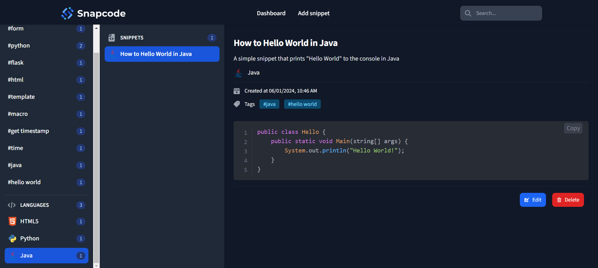

# Snapcode - Your code snippets manager

## Overview



Snapcode is a simple code snippets manager that helps you keep all your code snippets organized in one place.

Features included:

- List all snippets
- View a snippet in details
- Create a snippet
- Edit a snippet
- Delete a snippet
- Search, fitler snippets by tags, languages
- Sort snippets by created date, title
- Aggregate snippets by tags, languages

## Languages and frameworks used

<div style="display: flex; justify-content: center; gap: 1.5rem">
  
  
  
  
  
  
</div>

## Setup and Installation

Prerequisites:

- [Python](https://python.org) (version 3.6 or higher)
- [Node.js](https://nodejs.org) (version 14 or higher)

Clone the project from GitHub

```bash
git clone https://github.com/alphazero-wd/snapcode.git
```

Install the necessary dependencies

```bash
npm i -g yarn
cd snapcode/
pip install -r requirements.txt
yarn
```

Run TailwindCSS compiler (in watch mode)

```bash
yarn tw
```

Start the main application

```bash
python app.py # on Windows
# python3 app.py (Mac, Linux)
```

Go to [http://localhost:5000](http://localhost:5000) in the browser.

The application should be up and running.

Enjoy using Snapcode :)
